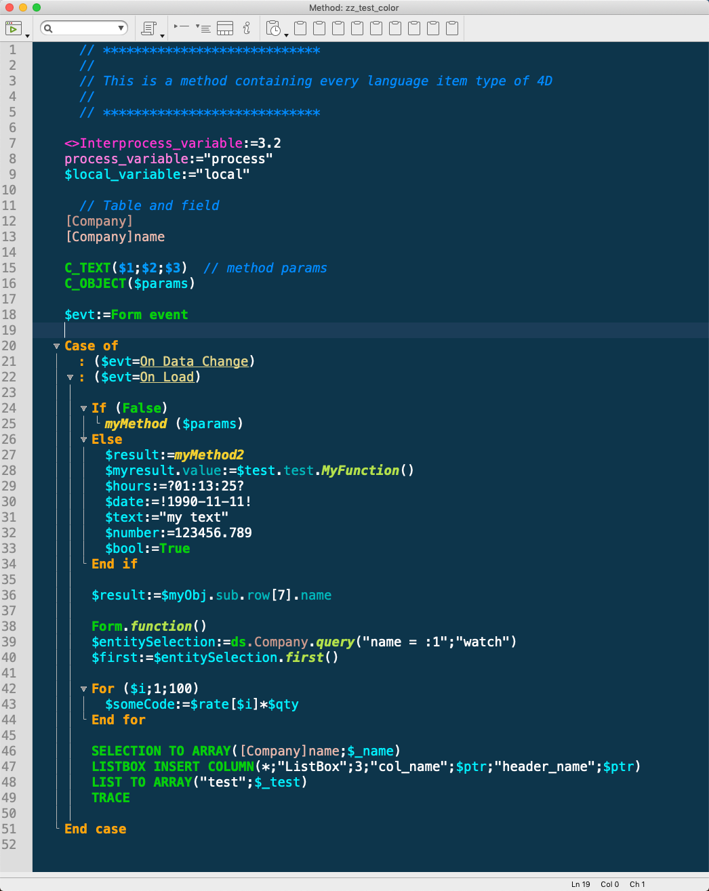

# Cobalt2 Theme for 4D

## Installation

1. Download the `4D Editor Themes/cobalt2.json` file.
2. Go to the `Active 4D Folder`
   1. Windows 7 and higher: `{disk}\Users\{UserName}\AppData\Roaming\4D\`
   2. MacOS: `{disk}:Users:{UserName}:Library:Application Support:4D:`
3. Paste the `cobalt2.json` file into `4D Editor Themes` folder.

For 4D version <19 check the [README_old.md](https://github.com/Ganbin/cobalt2-4D/blob/master/README_old.md) file.

### Credits

This theme is an 4D adaptation of the [wesbos/cobalt2-vscode](https://github.com/wesbos/cobalt2-vscode) theme.
